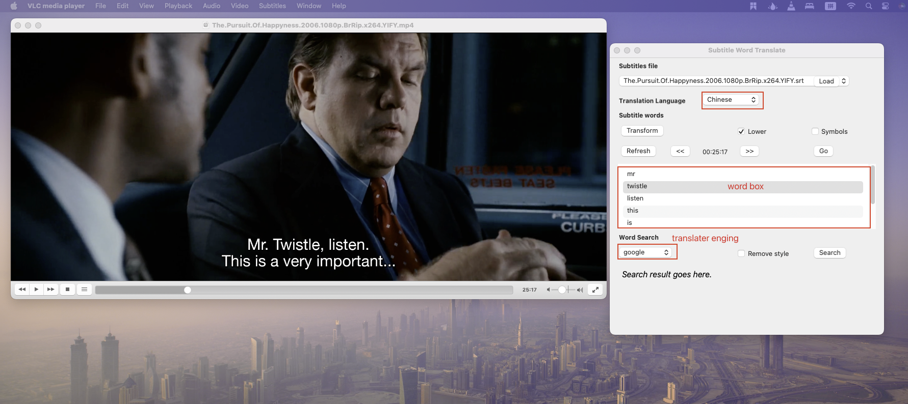
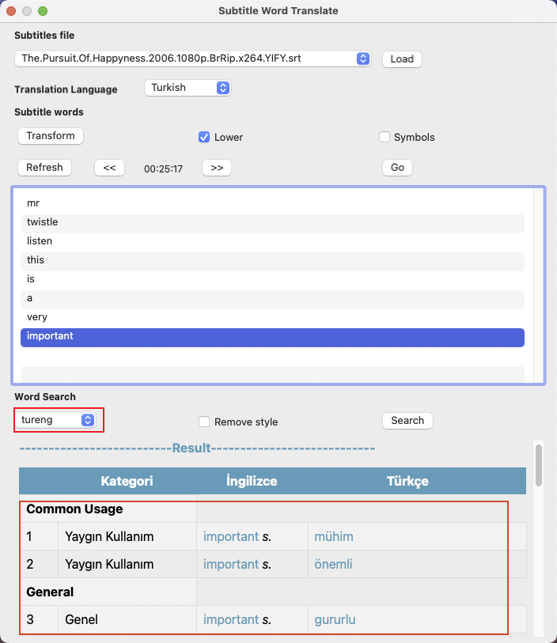

"subtitle_word_search" is an extension for the VLC player that allows for quick subtitle searches. This extension supports Google Translate and the Tureng dictionary, and is compatible with both Windows and Mac.

## 1. Download VLC Extensions
subtitle_word_search : [download](https://github.com/sulaymanyf/subtitle_word_search/archive/refs/tags/v1.0.0.zip).

## 2. Installing VLC Extensions
VLC player :https://www.videolan.org/vlc/  
For Windows:
Download the Extension: Save the .lua file to your computer.
Locate the VLC Extensions Folder: Navigate to the following directory:
C:\Program Files\VideoLAN\VLC\lua\extensions\
If you installed VLC in a custom directory, navigate there.
Copy the .lua File: Place the downloaded .lua file into the extensions folder.
Restart VLC: If VLC was open during this process, restart it to load the new extension.
For Mac:
Download the Extension: Save the .lua file.
Access the Extensions Directory: Open Finder, press Cmd + Shift + G to open the Go to Folder dialog, and enter:
~/Applications/VLC.app/Contents/MacOS/share/lua/extensions

## 3. Using VLC Extensions
](1.png)

